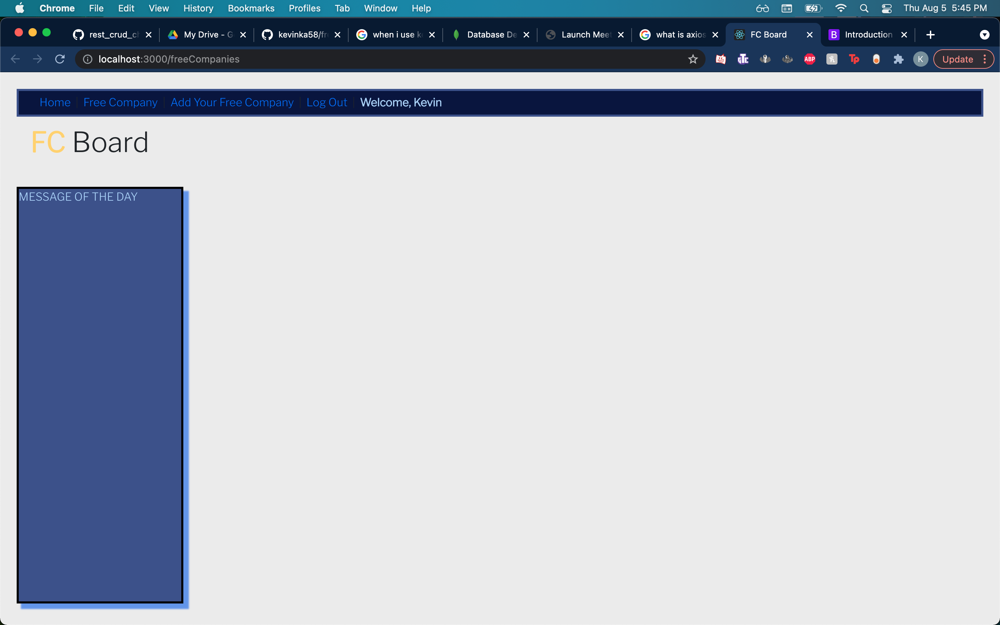
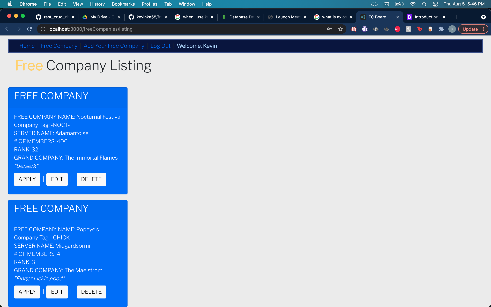
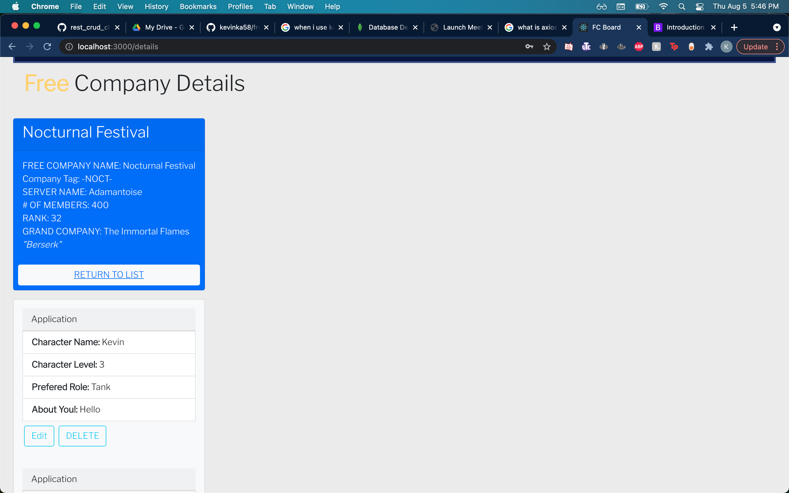
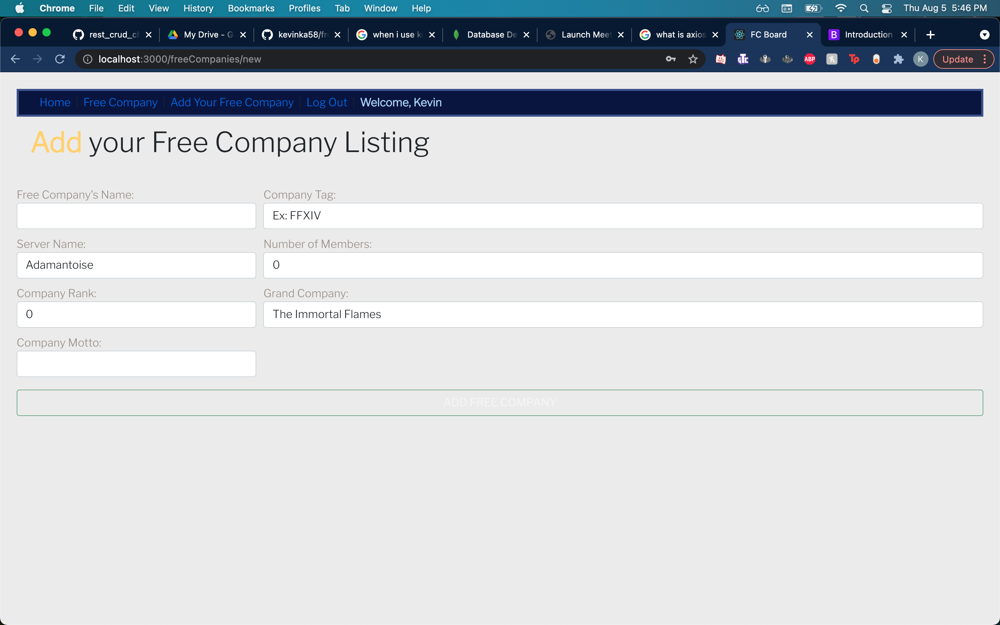

# App: FC Board

FC Board allows users to search and post Free Company listings that exist within the MMORPG "Final Fantasy XIV". Within the game there are communities who create "Free Companies" or FC's and joining one is the generally how most people meet other players and create community. However there is no good of way of searching for one and being able to send your regards or interest.

# Technologies Used
* MongoDB
* Express
* React
* Node.js
* CSS

# Screenshots

# Getting Started

[Deployed App](https://free-company-app.herokuapp.com/)
[Trello Board](https://trello.com/b/TrNFph50/project-3-final-fantasy)

# Next Steps (Icebox)
- I would like to be able to use a Final Fantasy API to allow users to directly access their Free Company rather than input their information
- Allow user's to post images of their characters
- Implement filter tags ex: 'Raider', 'Casual', 'Gathering', etc...
- Allow User's to have a profile that display's interests
- Further increase authorization features
-
